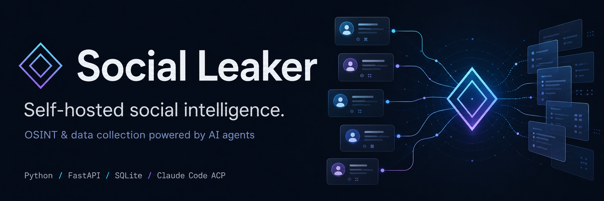

<p align="center">
  
</p>

<h1 align="center">◈ Social Leaker</h1>

<p align="center">
  <b>A self-hosted social-media intelligence &amp; data-collection platform.</b><br>
  Objective-driven tasks · a managed collection loop · a Claude Code agent · local SQLite.
</p>

<p align="center">
  
  
  
  
  
</p>

---

## What it is

Social Leaker turns a plain-language objective into a **structured, exportable dataset**.
You describe what you want; a managed agent loop **plans → discovers → collects → paces →
resumes** until the job is done. Every step is traceable and every record is exportable —
all on infrastructure you control.

Built for **authorised** OSINT, competitive research and audience analysis.

---

## ✨ Features

- **Web panel** with username/password auth (JWT + secure cookie) and roles (`admin` / `operator` / `viewer`).
- **Objective-driven Tasks** — write a prompt (or seed handles); the runner works the goal on its own.
- **Managed collection loop** — plan → collect → assess, with adaptive **rate-limit backoff** so throttling pauses and retries instead of failing.
- **Resumable jobs** — if the server stops mid-task, it **continues after a restart** from where it left off (no duplicates).
- **Sequential task queue** — tasks run one at a time; add follow-up prompts that line up and run in turn.
- **Claude Code agent** — sign in with your **Claude Code login (OAuth)** via the official Claude Agent SDK — no API key. Optionally used for **AI-assisted discovery** of public pages on a topic.
- **Instagram engine** via **Instaloader** — reads real public profile data **without a login**; an optional **Session ID** raises reliability and enables search discovery.
- **Reddit engine** — public user data via Reddit's open JSON (no login).
- **12-platform catalog** — Instagram &amp; Reddit live; TikTok, X, LinkedIn, YouTube, Facebook, Threads, Telegram, Pinterest, Mastodon, Snapchat on the roadmap.
- **Full exports** — per-task CSV, per-task JSON report, and a complete workspace report.
- **Dashboard reporting** — connections, tasks, usage, reach, verified counts.
- **Docker** — one image, database kept **outside** the container.

---

## 🚀 Run with Docker (recommended)

```bash
cp .env.example .env          # then edit SECRET_KEY
docker compose up -d --build
# open http://localhost:8000   (default login: admin / admin)
```

The SQLite database and any sessions live on the host in `./data`, so your data survives
rebuilds and `docker compose down`.

## 🐍 Run locally

```bash
pip install -r requirements.txt
cp .env.example .env                 # edit SECRET_KEY
python -m socialleaker.cli init      # DB + admin (admin / admin)
python -m socialleaker.cli serve     # http://127.0.0.1:8000
```

For the Claude agent, sign in to Claude Code on the machine (the bundled CLI in
`claude-agent-sdk` reuses that login).

---

## 🧭 Using the panel

1. **Platforms** — Instagram &amp; Reddit work with no login. For Instagram *search/discovery*,
   connect a **Session ID** (browser cookie) — the reliable method that avoids Instagram's
   login blocks.
2. **Settings** — **Login with Claude Code** (OAuth) to enable AI-assisted discovery.
3. **Tasks → New task** — write a prompt and/or seed handles, set a goal, and run. Watch the
   **step-by-step** timeline and collected profiles; add **follow-ups**; export.
4. **Dashboard** — totals, connections, usage, and **Download full report**.

The current tab is kept in the URL, so a refresh stays where you are.

---

## 🖥️ CLI

```bash
python -m socialleaker.cli init                          # db + admin
python -m socialleaker.cli adduser alice --role operator
python -m socialleaker.cli users
python -m socialleaker.cli collect nasa nike --goal 30
python -m socialleaker.cli serve --reload
```

---

## 📁 Project layout

```
Social-Leaker/
├─ banner.png · logo.png
├─ Dockerfile · docker-compose.yml · .dockerignore
├─ run.py · requirements.txt · .env.example
├─ data/                          # sqlite db + sessions (git-ignored, host-mounted)
└─ socialleaker/
   ├─ config.py · database.py · models.py · schemas.py
   ├─ security.py · deps.py · main.py · cli.py
   ├─ routers/  auth · tasks · integrations · results · pages
   ├─ services/
   │  ├─ instagram.py           # engine registry + Instaloader/instagrapi + sandbox
   │  ├─ instaloader_engine.py  # public Instagram engine (no login)
   │  ├─ instagram_auth.py      # session-id / 2FA login + session store
   │  ├─ reddit_engine.py       # public Reddit engine
   │  ├─ claude_agent.py        # Claude Code via the official Agent SDK
   │  ├─ task_runner.py         # managed loop: discover, collect, pace, resume
   │  └─ queue_manager.py       # sequential queue + restart resume
   └─ web/                       # templates + static (dark UI, css, js)
```

---

## 🔐 Configuration (`.env`)

| Variable | Purpose |
|---|---|
| `SECRET_KEY` | Signs auth tokens — **change it**. |
| `DATABASE_URL` | SQLite path (default `sqlite:///./data/socialleaker.db`). |
| `ADMIN_USERNAME` / `ADMIN_PASSWORD` | First admin created by `init`. |
| `SCRAPE_MIN_DELAY` / `SCRAPE_MAX_DELAY` | Per-request pacing (s). |
| `SCRAPE_BACKOFF_BASE` / `SCRAPE_BACKOFF_MAX` / `SCRAPE_RETRIES` | Adaptive backoff on throttling. |
| `SCRAPE_MAX_ITEMS` | Safety ceiling of profiles per task. |

---

## ⚖️ Responsible use

Social Leaker is for **authorised** open-source intelligence, marketing research, and analysis
of accounts you own or have permission to study. It collects **public** data only, paces
requests to respect platform limits, and keeps every record on infrastructure you control.

Automated collection may conflict with a platform's Terms of Service, and personal data is
subject to laws such as the GDPR/CCPA. **You are responsible for lawful, authorised use.** Do
not use it for harassment, stalking, doxxing, or targeting private individuals. Provided as-is,
without warranty.

---

<p align="center">
  <b>A product of <a href="https://dibachain.ir/">Dibachain</a></b> · dibachain.ir
</p>
